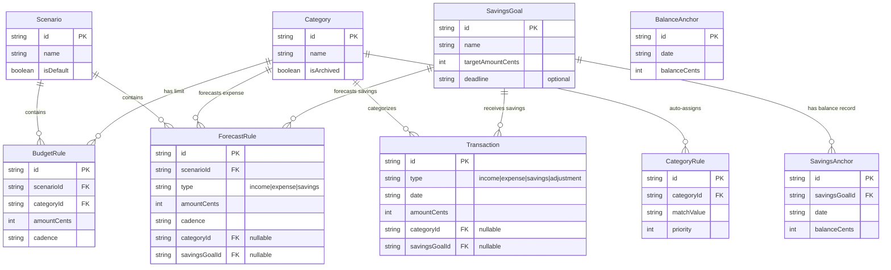
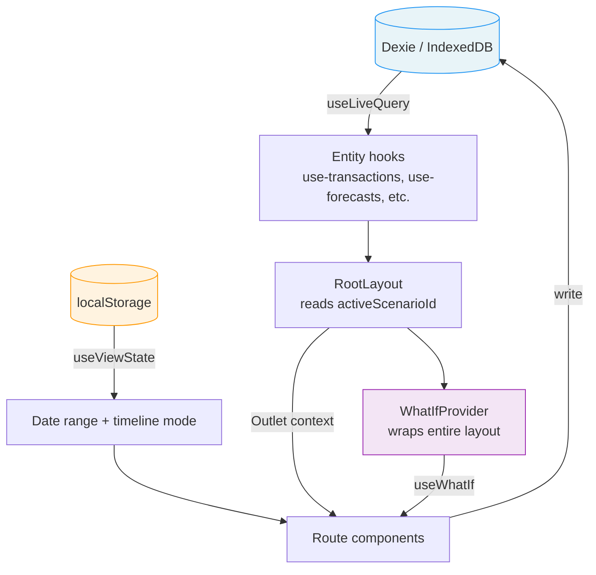
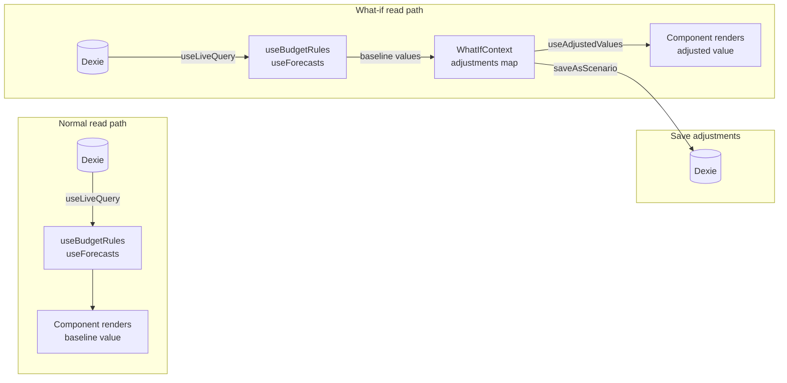
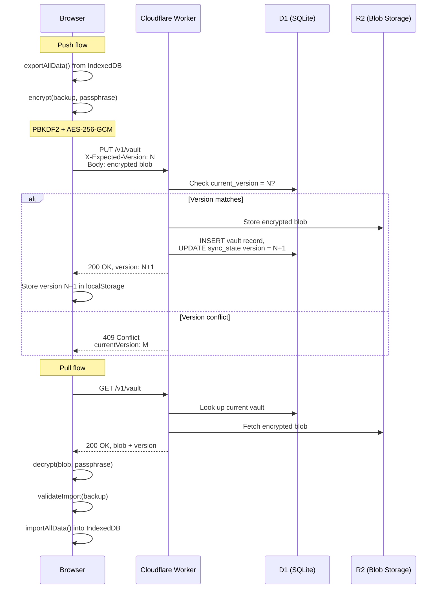
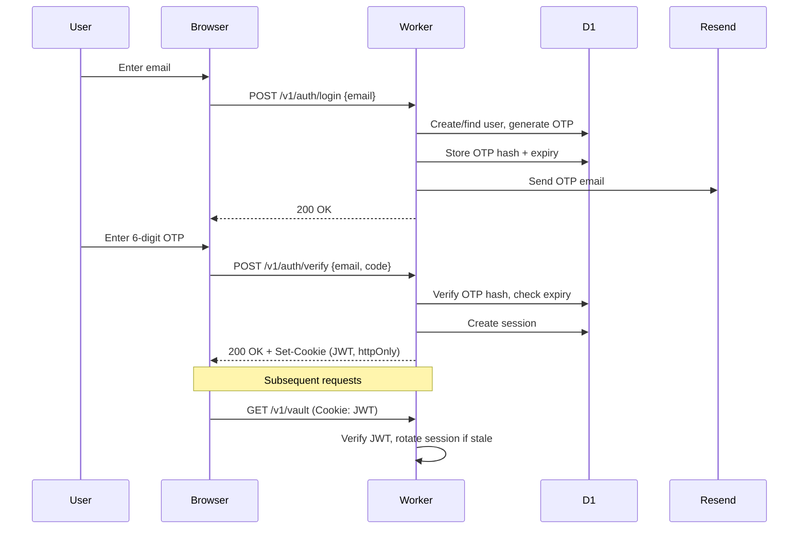
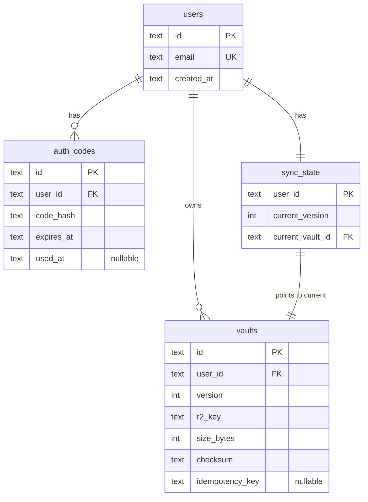

# Architecture

## What is SafelySpend?

SafelySpend is a personal budgeting app that answers one question: **"How much can I safely spend?"**

It separates **facts** (transactions you've already made) from **plans** (scenarios with budget rules and forecast rules). You can create multiple scenarios to do "what-if" planning — adjust income, budgets, or expenses in-memory and see the impact before committing.

The app is local-first: all user data lives in IndexedDB in the browser. An optional encrypted cloud sync feature backs data up to Cloudflare R2 via a Hono-based API worker.

Currently in beta (v0.37.0). AUD-centric with Australian financial year defaults (July 1 - June 30).

## Domain Model

All entities share base fields: `id`, `userId`, `createdAt`, `updatedAt`. Amounts are integer cents. Dates are ISO strings.

### Global entities (facts)

These exist independent of any scenario:

| Entity | Purpose |
|--------|---------|
| **Category** | Expense categorization. Has `isArchived` flag. |
| **Transaction** | Actual income/expenses/savings/adjustments. Types: `income`, `expense`, `savings`, `adjustment`. |
| **SavingsGoal** | Savings targets with optional deadline, interest rate, compounding schedule. |
| **BalanceAnchor** | Point-in-time balance snapshot (e.g., opening balance, reconciliation). |
| **SavingsAnchor** | Point-in-time balance record for a specific savings goal. |
| **CategoryRule** | Auto-categorization rules for imported transactions (match on description/payee). |

The `adjustment` transaction type is used for opening balances and manual corrections — it's how the app bootstraps a user's starting state.

### Scenario-scoped entities (plans)

These belong to a specific scenario:

| Entity | Purpose |
|--------|---------|
| **Scenario** | A named set of rules. One is marked `isDefault`. |
| **BudgetRule** | Spending limit per category with cadence. |
| **ForecastRule** | Recurring income/expense/savings pattern with cadence. |

### Computed types

| Type | Purpose |
|------|---------|
| **ExpandedForecast** | A materialized forecast for a specific date, computed by expanding a ForecastRule over a date range. |

### Cadence system

Rules use a `Cadence` type: `weekly | fortnightly | monthly | quarterly | yearly`.

Each cadence uses anchor fields to determine which day an occurrence falls on:
- `dayOfWeek` (0-6) for weekly/fortnightly
- `dayOfMonth` (1-31) for monthly/quarterly/yearly
- `monthOfQuarter` (0-2) for quarterly
- `monthOfYear` (0-11) for yearly

Rules expand over any date range to generate individual occurrences or calculate totals.

### Entity relationships



## Where Data Lives

### IndexedDB (Dexie)

Primary data store. Nine entity tables plus two config singletons (`appConfig`, `activeScenario`). Reactive reads via `useLiveQuery()` from `dexie-react-hooks`.

Database name: `BudgetApp`. Schema version history in `src/lib/db.ts`.

### localStorage

UI preferences only — never domain data. Keys centralized in `src/lib/storage-keys.ts`, all prefixed with `budget:`:

| Key | Purpose |
|-----|---------|
| `budget:viewState` | Date range / timeline picker state |
| `budget:theme` | Light/dark theme preference |
| `budget:demoPersonaId` | Selected demo persona |
| `budget:checkInNudgeDismissed` | Whether check-in banner was dismissed |
| `budget:syncLocalVersion` | Cloud sync vault version |
| `budget:syncLastSyncedAt` | Cloud sync timestamp |

### What leaves the device

Almost nothing, and only when asked:

- **Cloud sync** (opt-in) — an encrypted blob. Encryption happens on the device; the server holds ciphertext it cannot read.
- **Landing page analytics** — a single pageview for visitors who have not set the app up yet. No domain data, no cookies, nothing identifying. Fires from exactly one place, `src/lib/analytics.ts`, called only by the landing page. Nothing inside the app is measured.

Everything else stays in IndexedDB and localStorage on the device.

### URL state

Route params only (e.g., `/categories/:id`). No query-string state for filters.

### React state

- **WhatIfContext** — in-memory adjustment layer. Components read adjusted values without persisting. Wraps the entire `RootLayout`.
- **Form state** — managed by `@tanstack/react-form`.

## State Flow

How data moves from storage to the screen:



1. **Dexie DB is the source of truth.** `useLiveQuery()` in hooks provides reactive data — when DB changes, components re-render automatically.
2. **RootLayout** reads `activeScenarioId` from `useScenarios()` and passes it to children via `<Outlet context={}>`.
3. **Route components** call hooks with `activeScenarioId` to get scenario-scoped rules.
4. **WhatIfProvider** wraps the entire layout — components can read adjusted values (income, budgets, expenses, savings) without persisting them. Adjustments are stored as `ruleId -> cents` deltas.
5. **useViewState** (localStorage) provides the date range for filtering transactions and expanding forecast rules.

## What-If System

The what-if system is the most architecturally interesting part of the app. Here's how a value flows from the database to the screen, with and without adjustments:



Key points:
- `WhatIfContext` stores adjustments as `Record<string, number>` maps (ruleId/categoryId to cents)
- Only values that differ from baseline are stored — no adjustment means "use the real value"
- `useAdjustedBudgets()` and `useAdjustedForecasts()` merge baseline + adjustments
- "Save as scenario" persists the adjusted values as new BudgetRule/ForecastRule entities
- The context resets when the user switches scenarios

## Cloud Sync Flow

End-to-end encrypted sync between browser and Cloudflare R2:



Key details:
- **Passphrase is session-only** — stored in a React ref, never persisted. User re-enters it each session.
- **Optimistic concurrency** — the `X-Expected-Version` header prevents lost updates. If another device pushed in between, you get a 409.
- **No merge** — this is last-writer-wins. On conflict, the user chooses to force-push (overwrite remote) or pull (overwrite local).
- **Orphan cleanup** — if the D1 write fails after the R2 upload, the R2 object is cleaned up immediately. A daily cron catches any that slip through.
- **Idempotency** — uploads include an optional `X-Idempotency-Key` header so retries don't create duplicate versions.

## Backend Architecture (Cloudflare Workers)

The backend is a Hono app deployed to Cloudflare Workers. It provides two concerns: **auth** and **vault sync**.

### Stack

| Service | Technology |
|---------|-----------|
| Runtime | Cloudflare Workers |
| Database | Cloudflare D1 (SQLite) |
| Blob storage | Cloudflare R2 |
| Email | Resend API |
| Framework | Hono |

### API routes

All routes prefixed with `/v1`:

- `/v1/auth/*` — Login (email OTP), verify, session, logout, account deletion
- `/v1/vault/*` — Upload, download, version history, pruning

### Auth flow



Brute-force protection: after 5 failed OTP attempts, the code is invalidated. Rate limiting on login and verify endpoints.

### D1 schema (simplified)



### Security measures

- CORS restricted to `APP_URL` (+ localhost in dev)
- Security headers: `X-Content-Type-Options`, `Referrer-Policy`, `Strict-Transport-Security`
- D1-backed rate limiting (IP + per-user) with graceful degradation
- 50 MB per-user storage quota
- Structured JSON logging with request IDs

## Encryption Format

The client-side encryption format (`src/lib/e2e-crypto.ts`):

```
┌─────────┬──────────────┬────────────┬─────────────────────────┐
│ VERSION │     SALT     │     IV     │   CIPHERTEXT + GCM TAG  │
│ 1 byte  │   16 bytes   │  12 bytes  │      variable length    │
└─────────┴──────────────┴────────────┴─────────────────────────┘
```

- **Version**: Currently `1`. Allows future format changes without breaking existing vaults.
- **PBKDF2**: 600,000 iterations, SHA-256, random salt per encryption.
- **AES-256-GCM**: Authenticated encryption. Wrong passphrase = `OperationError` (GCM tag mismatch).
- There is no v2 migration path yet. Changing this format is a breaking change — see the don't-touch list in `HANDOVER.md`.

## Key Tradeoffs

| Decision | Upside | Downside |
|----------|--------|----------|
| Local-first with optional sync | Great offline experience, user owns data | Complex conflict resolution, data loss if browser storage cleared |
| Blob sync (vs per-entity) | Simple protocol, one upload/download | All-or-nothing — no partial sync, no collaborative editing |
| Dexie/IndexedDB (vs localStorage) | Structured queries, handles large datasets | More complex migration story (versioned schemas) |
| No ORM on backend | Fast, minimal dependencies | Manual SQL, no type-safe queries |
| `userId: 'local'` placeholder | Simple single-user model | Multi-user deferred despite auth existing |
| AUD-only | Ships faster | Currency/locale selection is a future feature |
| Client-side encryption | Server never sees data, strong privacy | Forgotten passphrase = permanent data loss |
| Cadence expansion in hooks | Close to where data is consumed | Logic duplicated across use-budget-rules, use-forecasts, use-multi-period-summary |
